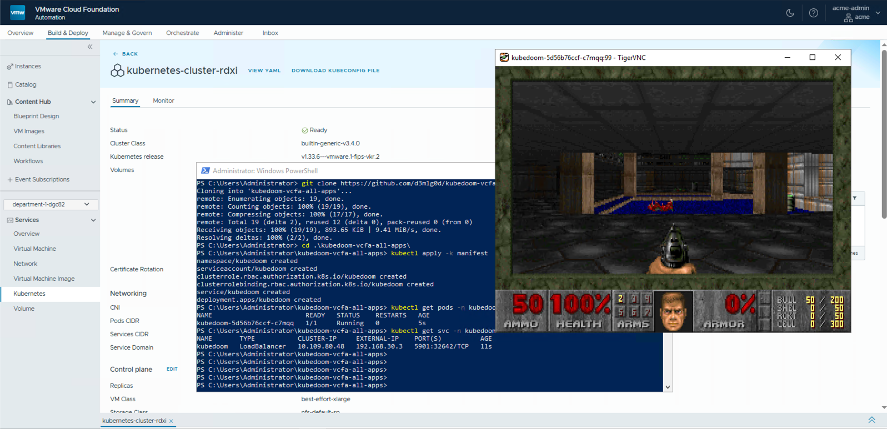

# Kube DOOM in a VMware Cloud Foundation 9 All-Apps tenant organization 
## Kill Kubernetes pods using Id's Doom!

The next level of chaos engineering is here! Kill pods inside your Kubernetes
cluster by shooting them in Doom!

This enables the deployment of the excellent doom fork 
[storax/kubedoom](https://github.com/storax/kubedoom) on the VMware Cloud Foundation 9 
private cloud stack using an all-apps organization with VKS and VPCs.



## Setup

In order to run it on VCF 9 as a all-apps tenant you will need to

1. Run the kubedoom container
2. Deploy a Load Balancer in the external IP block defined for the region and map it to the port on the pod
3. Attach a VNC client to the Load Balancer address and port (5901)

### Running Kubedoom inside VKS with VPC and a Load Balancer

Create a Kubernetes Guest Cluster in VCF Automation portal as described in my 
[blog](https://adrian.heissler.at/2026/03/deploy-virtual-machines-and-kubernetes-workloads-in-a-vcf-automation-9-all-apps-organization/). 

Then run kubedoom inside the cluster by applying the manifest provided in this repository:

```console
$ kubectl apply -k manifest/
namespace/kubedoom created
namespace/kubedoom-monsters created
serviceaccount/kubedoom created
role.rbac.authorization.k8s.io/kubedoom created
rolebinding.rbac.authorization.k8s.io/kubedoom created
service/kubedoom created
deployment.apps/kubedoom created
```

To create the pod monsters in the game, deploy a pod inside the kubedoom-monsters namespace, e.g.:

```console
kubectl create deployment nginx --image nginx -n kubedoom-monsters
```

To connect run:
```console
$ vncviewer viewer vnc-server:5901
```

You should now see DOOM! Now if you want to get the job done quickly enter the
cheat `idspispopd` and walk through the wall on your right. You should be
greeted by your pods as little pink monsters. Press `CTRL` to fire. If the
pistol is not your thing, cheat with `idkfa` and press `5` for a nice surprise.
Pause the game with `ESC`.


This setup has been tested with VMware Cloud Foundation 9.0.2.
